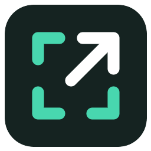
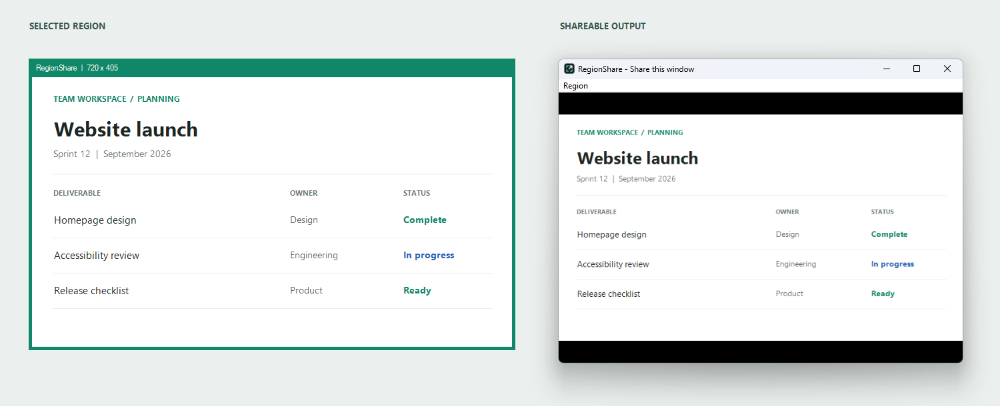
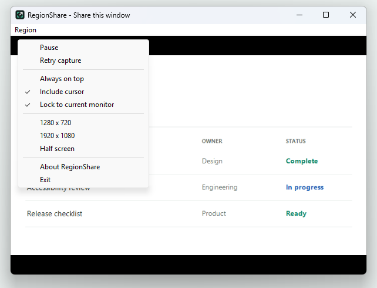

<p align="center">
  
</p>

# RegionShare

**Share part of your screen through a normal window.**

RegionShare is a free, open-source Windows 11 utility. Position a region outline
over the content you want to present, then choose the RegionShare output in your
meeting app's **Share window** picker.

No meeting-app plugin, account, or subscription. RegionShare captures and renders
locally; your meeting app handles broadcasting.



*Real application screenshot with a synthetic sample document. The green outline
selects the source; the separate output window shows the captured region.*

## Status

**0.1.0 Preview** targets Windows 11 x64. Native builds and automated desktop
capture tests pass. Meeting-app compatibility and mixed-DPI hardware testing are
still in progress, so this is an early preview rather than a production release.

## Get RegionShare

Build from source using the instructions below, or download the portable ZIP
from this repository's [**Releases**](https://github.com/timovaris/screenshare/releases) page once a preview has been published.
No public download is published yet.

Extract the ZIP and run `RegShare.exe`. Installation and administrator rights are
not required to run it. Preview binaries are unsigned.

## Use

1. **Frame the content.** Drag the green outline's header and resize its edges.
   Its hollow center lets you interact with the applications underneath.
2. **Place the output.** Keep the output window outside the selected region,
   either elsewhere on the same screen or on another monitor.
3. **Share the window.** In your meeting app, select
   **RegionShare - Share this window**.

Moving or resizing the outline changes the captured region. Resizing the output
preserves the source aspect ratio and adds black bars as needed.

### Controls

Open the **Region** menu, or right-click the outline's header.

| Control | Behavior |
| --- | --- |
| Pause / Resume | Stop capture and clear the output; resume live capture |
| Retry capture | Restart the capture session |
| Always on top | Keep the output above other windows |
| Include cursor | Include the mouse pointer; enabled by default |
| Lock to current monitor | Pin the source monitor; enabled by default |
| 1280 x 720 / 1920 x 1080 | Apply a fixed-size region in physical pixels |
| Half screen | Apply a region half the monitor work-area width |



Unlocking the monitor follows the monitor containing most of the outline.
Minimizing the output pauses capture and hides the outline; restoring resumes it.

## Why Two Windows?

A window placed over its own screen-capture region would capture itself.
Windows' capture-exclusion setting is window-wide: excluding that output would
also hide it from compatible meeting capture APIs.

RegionShare excludes only the selector and keeps the output shareable. If the
output overlaps the source, capture pauses automatically until they are separated.
See the [architecture notes](docs/architecture.md) for details.

## Features

- Native C++ and Win32 with Windows Graphics Capture and Direct3D 11.
- GPU capture, crop, and rendering without CPU pixel readback.
- Presentation capped at 30 FPS; actual cadence can be lower.
- Per-Monitor DPI Awareness v2 and physical-pixel region mapping.
- Visible error status, automatic retries, and overlap protection.
- Portable executable with no third-party runtime dependencies.

## Known Limitations

- Sharing uses the meeting app's existing window-capture feature. Compatibility
  with Teams, Zoom, Webex, and Meet has **not yet been validated**.
- Only one monitor supplies pixels. Areas outside it appear black. A full-monitor
  region needs room for the output on another monitor.
- Protected video may appear black. HDR tone mapping is not implemented;
  capture uses BGRA8 SDR. Enterprise policy can prevent capture.
- Preferences and window positions are not saved between sessions yet.
- Global hotkeys, multiple regions, signed binaries, and an installer are deferred.

See the [project status](docs/status.md) and [acceptance checklist](docs/validation.md)
for tested behavior and remaining validation.

## Build From Source

Prerequisites:

- Windows 11.
- Visual Studio 2022 or Build Tools with MSVC x64 C++ tools.
- Windows SDK 10.0.19041 or newer, including C++/WinRT.
- CMake 3.20 or newer.

From a Windows terminal in the checkout:

```bat
scripts\build.cmd
```

The script builds Release, runs coordinate tests, and produces
`build\windows\Release\RegShare.exe`. The MSVC runtime is linked statically.
For best incremental-build behavior, use a checkout on a Windows filesystem;
WSL UNC paths can produce MSBuild dependency-path casing warnings.

If an existing Build Tools installation is missing its compiler,
`scripts\install-build-tools.ps1` adds that component with administrator elevation.

### Test And Package

```powershell
powershell -ExecutionPolicy Bypass -File scripts\smoke-test.ps1
powershell -ExecutionPolicy Bypass -File scripts\package.ps1
```

The desktop smoke test opens a sample source and verifies live pixels, recropping,
presets, and window states. Close other RegionShare instances first. Packaging
produces a ZIP containing the executable, license, and documentation, plus a
SHA-256 checksum in `dist`.

GitHub Actions builds and tests on Windows and uploads the portable package as an
artifact. GUI capture tests must be run on an interactive Windows desktop.

Coordinate tests can also run on Linux:

```sh
cmake -S . -B build -DBUILD_TESTING=ON
cmake --build build
ctest --test-dir build --output-on-failure
```

Non-Windows builds only produce coordinate tests, not the application.

## Contribute

Compatibility reports are especially useful: include your Windows build, GPU,
monitor resolution/scaling, and meeting app. See [CONTRIBUTING.md](CONTRIBUTING.md)
for reporting bugs and submitting changes.

Next priorities are broader compatibility testing, saved preferences, better
output placement, and keyboard/accessibility improvements. The
[publishing checklist](docs/publishing.md) covers the first GitHub preview.

## License

[MIT](LICENSE). Free to use, modify, and redistribute, including commercial use,
subject to the license terms.
